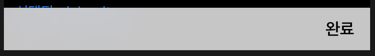
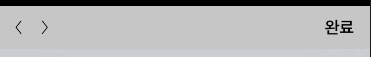

# customTextField
textfield framework

```swift
import CustomTextField

var txt1: CustomTextField!
```

## input 영역 설정
```swift
txt1.setTextFieldLayout(inset: UIEdgeInsets(top: 10, left: 10, bottom: 10, right: 5), maxInput: 10, useAccessoryView: .Default, font: UIFont.systemFont(ofSize: 10))
txt1.setFontColor(color: UIColor.yellow)
txt1.setPlaceholder(txt: "뭔가 입력하세여")
```

  * ccessoryView.Default
  

  * accessoryView.NextPrevious
  
  
  * AccessoryView Notification
  ```swift
  extension Notification.Name {
    //input accessory
    static let CustomInputAccessoryDone = Notification.Name("CustomInputAccessoryDone")
    static let CustomInputAccessoryNext = Notification.Name("CustomInputAccessoryNext")
    static let CustomInputAccessoryPrev = Notification.Name("CustomInputAccessoryPrev")
}
  ```

  ## 왼쪽 아이콘 설정
  ```swift
  txt1.setIconLayout(img: UIImage(named: "icon")!, inset: UIEdgeInsets(top: 10, left: 10, bottom: 10, right: 5))
  ```
  
  ## 오른쪽 아이콘 설정
  ```swift
  txt1.setAdditionalIcon(img: UIImage(named: "icon")!, trailingInset: 16)
  ```
  
  ## 키보드 타입
  ```swift
  txt1.setKeyboardType(type: UIKeyboardType.numberPad)
  ```
  
  ## clearButton 설정
  ```swift
  txt1.setClearButton(mode: .never)
  ```
  
  ## border
  ```swift
  txt1.setTextFieldLine(edge: [.top, .bottom], color: UIColor.white, thickness: 1)
  ```
  
  ## pickerView 사용
  ```swift
  var pickerList:[String] = []
  pickerList.append("가가가가가")
  pickerList.append("니니니니니")
  pickerList.append("다다다다다")
  
  txt1.usePickerView(listTitle: pickerList)
  
  /*
   기본적으로 선택될 항목 지정
   idx : default 0
  */
  txt1.setDefaultPickerSelected(idx: 1)
  ```
  
  ### 선택된 pickerView 아이템 가져오기
  ```swift
  let idx = txt1.inputPickerView.selectedRow(inComponent: 0)
  ```
  
## CustomTextFieldDelegate
### textField(_ textField: UITextField, shouldChangeCharactersIn range: NSRange, replacementString string: String) -> Bool
